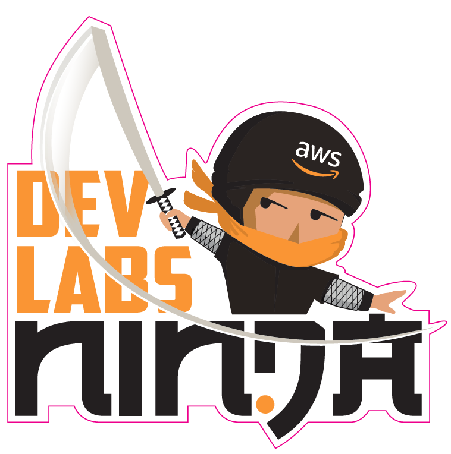
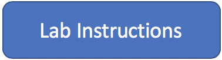

# Welcome to Dev Labs, let's get started!

This is a set of developer oriented labs built for one of the aws summit events. If you're doing these at a summit then free lab accounts will be provided for you. If you are running these labs in your own aws accounts then you will incur charges for the resources provisioned for the labs.

Each lab takes approximately 15 minutes.

> Disclaimer: These labs are meant for learning purposes only, they are not meant to be used in production in any way shape or form.

## Instructions

* Select a lab to work through
* Click on "Lab Instructions"
* Click on "Go to Console"
* Follow instructions of specific lab to walk through it
* Fill in "Give Feedback" to win a $50 Amazon gift voucher
* Enjoy!

<!-- Scan Feedback Link

 -->

## Select a lab from below to begin

### **1) Building and Debugging Lambdas with Cloud9**

Build a simple Lambda Function that sits behind an API gateway endpoint, learn how to use the Cloud9 IDE to Build, Debug and Deploy this Function.

</a>

### **2) Build and run a Containerized web app using ECS & Docker**

In this lab we will learn how to build and run a containerised application. We will then use the Amazon Elastic Container Service to host and run this container in the Cloud.

### **3) Build, Deploy and Operate full applications with Serverless backends in minutes using the AWS Amplify Framework**

In this workshop we'll learn how to build the Vote Rocket voting web application with React and the Amplify Framework

### **4) Getting started with AWS Serverless Application Model (AWS SAM)**

Build a sample serverless application using the AWS Serverless Application Model (AWS SAM). SAM is an open-source framework for building serverless applications.

### **5) Automate static website deployments to S3 using CodePipeline**

This lab walks you through the steps to host and deploy static websites to S3 using CodePipeline. 

### **6) Build an AI Virtual Concierge using Amazon Sumerian**

In this lab you will be building a virtual concierge powered using Amazon Sumerian. 

### **7) Build a Transit VPC and Egress Solution using TGW**

In this lab we will learn how to build and run a centralised NAT/Egress proxy solution using Transit Gateway.

### **8) Securing Multi-tenant SaaS Applications Built On Serverless Microservices**

In this DevLab, you'll crack open the IDE to secure a SaaS platform built on a ReactJS web app and NodeJS serverless microservices.

### **9) How to control & monitor microservices on AWS**

In this lab you'll learn how to use aws app mesh to monitor and route traffic between your microservices.

### **10) Explore GraphQL with AppSync and Transcribe**

The goal of this lab is to build a simple audio notes application that asynchronously generates a text transcription of voice notes

### **11) Working effectively with the AWS Command Line Interface**

Learn how to become a super effecient user of the aws cli

### **12) Turbocharging Reinforcement Learning with SageMakerRL**

This workshop shows you how you can parallelise the training of your reinforcement learning algorithms with SageMaker to get insanely fast turn around times & results for your reinforcement learning experiments.

### **13) Integrate Your Favourite Microsoft DevOps Tools With AWS**

This lab demonstrates how you can integrate AWS Elastic Beanstalk with Azure DevOps to automatically deploy an ASP.NET core MVC application. 

### **14) Build a contact center for booking and checking appointment with AWS Connect/Lex/Lambda**

In this lab we, you will be building a contact center using Amazon Connect and integrating with Amazon Lex. 

### **15) Build an office scheduler with Lex/DDB/Twilio**

This Lab will walk you through how you can use Amazon Lex with Twilio to create an office scheduler. Appointments will be facilitated with the afformentioned services and stored in DynamoDB.

### **16) Build An Alexa-Hosted Fact Skill**

With an Alexa-hosted skill, you can build, edit, and publish a skill without leaving the developer console.

### **17) Use Amazon Transcribe and Amazon Comprehend to analyze customer sentiment**

Use Amazon Transcribe and Amazon Comprehend to analyze customer sentiment

## Thanks for completing a lab, hope you had fun!
Please scan QR Code for a chance to win a $50 amazon voucher

<!-- 
 -->

<!-- <a href="https://amazonmr.au1.qualtrics.com/jfe/form/SV_09usL1Ng0FmVFzL"> -->

We really appreciate your feedback and would love to hear about what you loved and what we can imnprove.

#### Please give us feedback so we can improve these labs.

